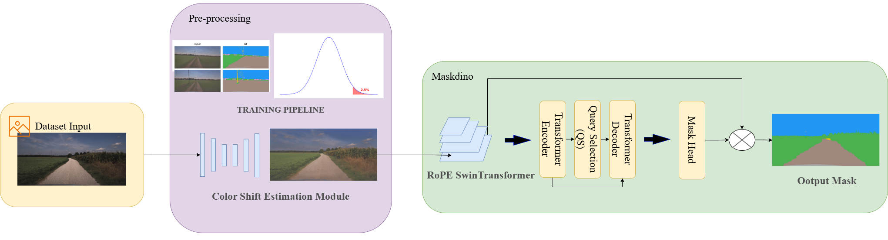

# 2025_GOOSE_2D_MaskDINO

This repository contains the implementation for **2D semantic segmentation** in the GOOSE 2025 challenge, based on **MaskDINO**.

## 🔧 Architecture Overview

The model is built on top of the MaskDINO framework, which incorporates transformer-based encoder-decoder design with improved query-based denoising strategies and dynamic anchor boxes.

<p align="center">
  
</p>

*Please place your architecture image in `assets/model_architecture.png`.*

## 🚀 Features

- Based on **MaskDINO** for high-performance segmentation.
- Integrated improvements from:
  - DINO (DETR with Improved DeNoising)
  - DN-DETR (Query Denoising)
  - DAB-DETR (Dynamic Anchor Boxes)

## 📦 Installation

```bash
git clone https://github.com/w5535586/2025_GOOSE_2D_MaskDINO.git
cd 2025_GOOSE_2D_MaskDINO
# Setup environment as needed
